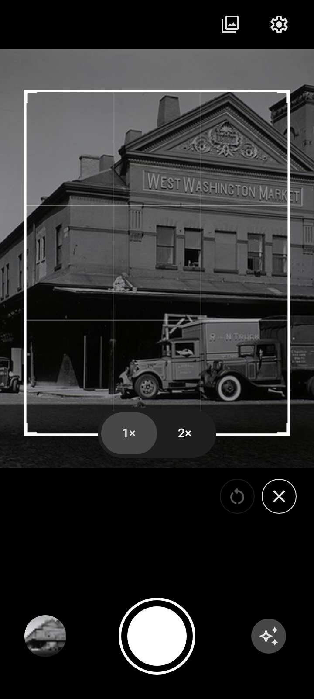
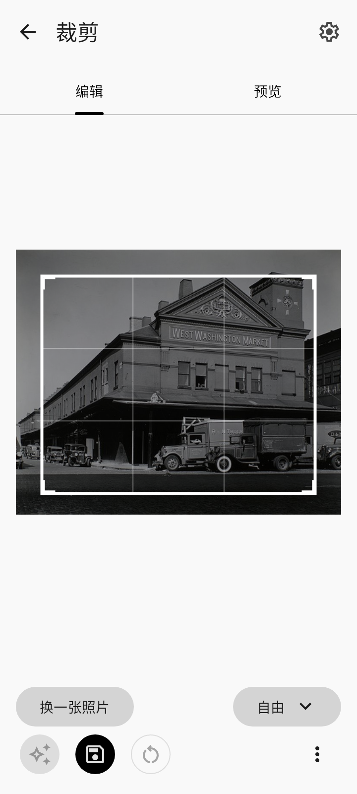

# Okulo

[English](README.en.md)

Android 辅助构图相机。

| 相机 | 裁剪 |
| --- | --- |
|  |  |

- **相机**：变焦、推荐裁剪构图。
- **裁剪**：导入照片，按自由或指定比例推荐裁剪构图。

界面示例照片：[Berenice Abbott / NYPL，公共领域](https://commons.wikimedia.org/wiki/File:West_Washington_Market,_Washington_Street_and_Loew_Avenue,_Manhattan_(NYPL_b13668355-482678).jpg)。

## 构建

需要 JDK 17 和 Android SDK 36。支持 Android 8.0 及以上，默认打包 `arm64-v8a`。

请按[模型资源说明](docs/model-assets.md)准备模型，然后执行：

```sh
./gradlew :app:assembleDebug
```

Windows 使用 `gradlew.bat`。APK：`app/build/outputs/apk/debug/app-debug.apk`。
